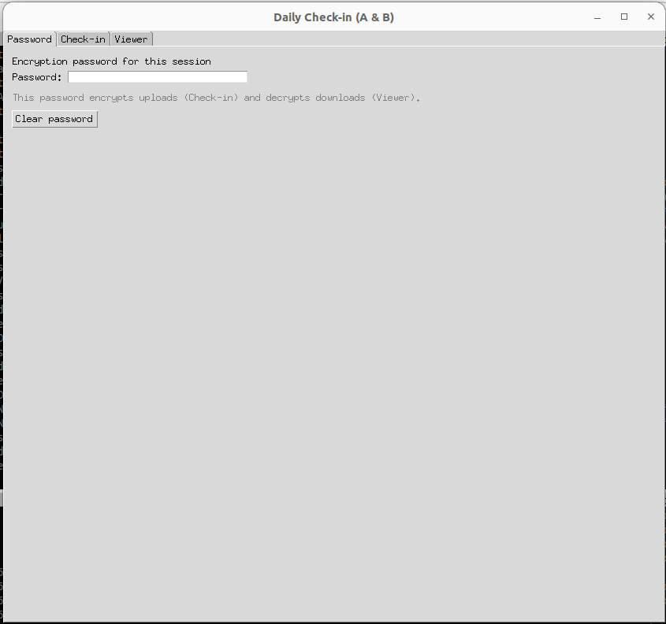
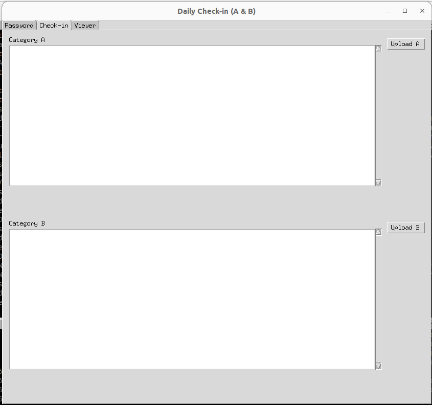
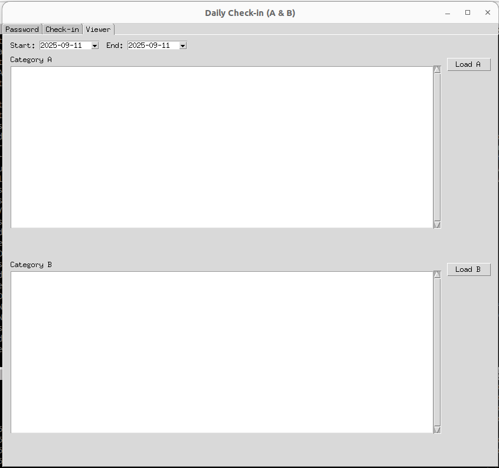

# 📝 Daily Check-in

**Daily Check-in** is a simple cross-platform desktop app (built with ) to log your daily notes in two categories (A and B).
Each entry is:

* Encrypted locally using  (`SecretBox` + )
* Stored in your  `AppDataFolder` (hidden, app-private storage)

You can later view your entries over any chosen date range.

---

## ✨ Features

* 🔐 Password-based end-to-end encryption
* ☁️ Seamless backup to Google Drive `AppDataFolder`
* 📆 Date range viewer to browse past entries
* 💾 Optional keychain integration (via ) to securely remember your password
* 🖥️ Simple three-tab GUI: Password, Check-in, Viewer

---


### 🔑 Password Tab

Set the encryption password for this session



---

### ✍️ Check-in Tab

Write and upload daily entries to Google Drive (encrypted) under Category A and Category B.



---

### 📂 Viewer Tab

Pick a start and end date to view your saved entries over a date range.


---

## ⚙️ Installation

```bash
git clone https://github.com/yourname/daily-checkin.git
cd daily-checkin
python -m venv .venv
source .venv/bin/activate   # on Windows use .venv\Scripts\activate
pip install -r requirements.txt
```

**Requirements:**

* &#x20;3.9+
* `tkinter`, `tkcalendar`, `google-auth-oauthlib`, `google-api-python-client`, `pynacl`, `keyring`

---

## 🔑 Setup

1. Create an OAuth client credential (Desktop app) in the&#x20;
2. Download the `credentials.json` into `./.secrets/credentials.json`
3. Run the app once — it will open a browser to complete Google sign-in and cache your token in `~/.daily_checkin_drive/token.json`

---

## 🚀 Usage

```bash
python app/daily_gui.py
```

Tabs:

* **Password:** enter or load your session password
* **Check-in:** write and upload new entries
* **Viewer:** select start/end dates and load previous entries

---

## 🔒 Security Notes

* Entries are encrypted locally before upload
* Each blob includes a version header and salt; keys are derived using Argon2id
* You can save the password in your system keychain (optional)
* Files are stored in Drive’s `appDataFolder` which is hidden from your normal Drive UI

---

## 📁 File Layout

```
daily-checkin/
├── app/
│   └── daily_gui.py
├── .secrets/
│   └── credentials.json
└── README.md
```

---

## 📜 License

[BSD-3-Clause](https://opensource.org/licenses/BSD-3-Clause)

